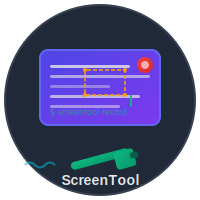
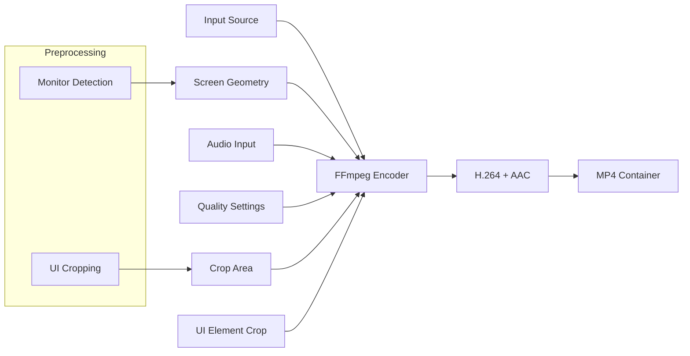

# ScreenTool

<div align="center">
  
  
  **Advanced Cross-Platform Screen Recording Tool**
  
  
  
  
  
</div>

## Overview

ScreenTool is a powerful, lightweight command-line screen recording utility designed for developers, content creators, and system administrators. Built with cross-platform compatibility in mind, it provides professional-grade recording capabilities with intelligent defaults and extensive customization options.

### Key Features

- 🎥 **High-Quality Recording**: H.264 encoding with configurable quality settings
- 🖥️ **Advanced Multi-Display Support**: 
  - Precise monitor selection and cropping
  - Automatic UI element exclusion (menu bar, dock)
  - Intelligent screen geometry detection
- 📐 **Smart Area Selection**: 
  - Click-to-position with standard resolution presets
  - Configurable UI cropping for clean recordings
- 🎵 **Advanced Audio**: Multiple input sources with quality presets
- 📊 **File Size Estimation**: Real-time bitrate and storage calculations
- 🖼️ **ASCII Visualization**: Visual representation of recording areas
- ⚡ **Performance Optimized**: Low CPU usage with efficient encoding
- 🔧 **Highly Configurable**: Persistent settings with environment management

## Quick Start

### Installation

```bash
# Clone the repository
git clone https://github.com/mricos/screentool.git
cd screentool

# Make executable
chmod +x screentool.sh st.sh

# Install dependencies (macOS)
brew install ffmpeg cliclick

# Install dependencies (Linux)
sudo apt install ffmpeg jq pulseaudio-utils x11-utils
```

### Basic Usage

```bash
# Record full screen
./screentool.sh record demo.mp4

# Set up area recording
./screentool.sh select-area

# Configure audio
./screentool.sh audio

# View screen layout
./screentool.sh geometry
```

## Technical Architecture

### Core Components

```
screentool/
├── screentool.sh              # Main entry point and command router
├── st.sh                      # Symlink for shorter command
├── env.sh               # Unified environment and configuration management
├── screentool_record.sh       # Recording engine and FFmpeg integration
├── screentool_record_mac.sh   # macOS-specific recording with multi-monitor support
├── screentool_audio.sh        # Audio device management and configuration
├── screentool_video.sh        # Video codec and quality settings
├── screentool_play.sh         # Playback and media controls
├── screentool_info.sh         # Metadata extraction and visualization
├── screentool_macos_devices.sh # macOS AVFoundation device detection
└── screentool.env             # Persistent configuration storage
```

**New Features in Core Components:**
- Enhanced multi-monitor detection
- Intelligent screen geometry mapping
- Configurable UI element cropping
- Automatic monitor selection

### Platform Abstraction

| Component | macOS | Linux |
|-----------|-------|-------|
| **Video Backend** | AVFoundation | X11Grab |
| **Audio Backend** | AVFoundation | PulseAudio |
| **Device Detection** | system_profiler | xrandr |
| **Screen Capture** | Capture screen N with UI cropping | DISPLAY=:0 |
| **Monitor Selection** | Intelligent geometry mapping | Display index selection |
| **UI Element Handling** | Automatic menu/dock exclusion | Configurable area selection |
| **Mouse Positioning** | cliclick | xdotool |

### Recording Pipeline



## Configuration Reference

### Video Settings

| Parameter | Default | Description | Impact |
|-----------|---------|-------------|---------|
| `VIDEO_CODEC` | libx264 | Video encoder | Quality/compatibility |
| `PRESET` | veryfast | Encoding speed | CPU usage |
| `CRF` | 23 | Quality factor (18-28) | File size/quality |
| `FRAMERATE` | 5 | Frames per second | Smoothness/size |
| `COMPRESSION_TUNE` | stillimage | Content optimization | Screen recording optimized |
| `COMPRESSION_GOP` | 300 | Keyframe interval | Seeking performance |

### Audio Settings

| Parameter | Default | Description | Bitrate |
|-----------|---------|-------------|---------|
| `AUDIO_CODEC` | aac | Audio encoder | - |
| `AUDIO_BITRATE` | 48000 | Sample rate (Hz) | - |
| `AUDIO_CHANNELS` | 1 | Channel count | Mono: ~96kbps, Stereo: ~192kbps |

### File Size Calculations

The tool provides accurate file size estimates based on:

```bash
# Base calculation formula
pixels = width × height
base_bitrate = pixels ÷ quality_factor
video_bitrate = base_bitrate × fps_multiplier × crf_factor
total_bitrate = video_bitrate + audio_bitrate
file_size_mb_per_hour = total_bitrate × 3600 ÷ 8 ÷ 1024
```

**Quality Factors:**
- CRF 18-20: `pixels ÷ 1000` (high quality)
- CRF 21-23: `pixels ÷ 1500` (medium quality)
- CRF 24-26: `pixels ÷ 2000` (lower quality)

**FPS Multipliers:**
- 1-3 fps: 0.3× (minimal motion)
- 4-6 fps: 0.5× (typical screen recording)
- 10-15 fps: 0.8× (smooth motion)
- 24-30 fps: 1.0× (full motion)

### UI Cropping Configuration

| Parameter | Default | Description | Example |
|-----------|---------|-------------|---------|
| `ST_CROP_UI_ELEMENTS` | false | Enable UI element cropping | true/false |
| `ST_MENU_BAR_HEIGHT` | 28 | Height of menu bar in pixels | 24-32 |
| `ST_DOCK_HEIGHT` | 70 | Height of dock in pixels | 50-90 |

**Usage Example:**
```bash
# Enable UI cropping and customize dimensions
export ST_CROP_UI_ELEMENTS=true
export ST_MENU_BAR_HEIGHT=24
export ST_DOCK_HEIGHT=60
./screentool.sh record clean_demo.mp4
```

**Benefits:**
- Remove distracting UI elements
- Create professional-looking screen recordings
- Customize crop area to match your system's UI

## Command Reference

### Recording Commands

```bash
# Basic recording
./screentool.sh record [filename]

# Play recordings
./screentool.sh play [filename]

# List all recordings with metadata
./screentool.sh list
```

### Configuration Commands

```bash
# Select display/monitor
./screentool.sh select

# Interactive area selection with resolution presets
./screentool.sh select-area

# Clear area selection (record full screen)
./screentool.sh clear-area

# Configure audio input and quality
./screentool.sh audio

# Configure UI cropping
./screentool.sh ui-crop  # New command!
```

**UI Cropping Options:**
```bash
# Enable/disable UI element cropping
export ST_CROP_UI_ELEMENTS=true

# Customize menu bar and dock height
export ST_MENU_BAR_HEIGHT=24
export ST_DOCK_HEIGHT=60

# Save configuration
./screentool.sh save
```

### Information Commands

```bash
# ASCII visualization of screen geometry
./screentool.sh geometry

# Detailed file information
./screentool.sh info <file>

# Brief file summary
./screentool.sh summary <file>

# Raw metadata as JSON
./screentool.sh json <file>
```

### Device Management

```bash
# List audio input devices
./screentool.sh input

# List audio output devices
./screentool.sh output

# List video input devices
./screentool.sh video
```

### Environment Management

```bash
# Save current configuration
./screentool.sh save

# Load saved configuration
./screentool.sh load

# Display current environment
./screentool.sh env
```

## Advanced Usage

### Custom Recording Profiles

Create specialized configurations for different use cases:

```bash
# High-quality tutorial recording
export CRF=18
export FRAMERATE=15
export AUDIO_CHANNELS=2
./screentool.sh save

# Low-bandwidth streaming
export CRF=26
export FRAMERATE=5
export AUDIO_BITRATE=22050
./screentool.sh save
```

### Batch Recording

```bash
# Record multiple sessions with timestamps
for i in {1..5}; do
  ./screentool.sh record "session_$(date +%Y%m%d_%H%M%S).mp4"
  sleep 300  # 5-minute recordings
done
```

### Integration with Other Tools

```bash
# Combine with system monitoring
./screentool.sh record system_demo.mp4 &
top -l 5 -s 10
pkill -f screentool

# Automated testing workflows
./screentool.sh select-area  # Set up test area
./screentool.sh record test_$(git rev-parse --short HEAD).mp4 &
./run_tests.sh
pkill -f screentool
```

## Troubleshooting

### Common Issues

**macOS Permission Errors**
```bash
# Grant permissions in System Preferences > Security & Privacy
# - Screen Recording: Terminal/iTerm
# - Microphone: Terminal/iTerm
```

**Linux Audio Issues**
```bash
# Check PulseAudio status
pulseaudio --check
systemctl --user status pulseaudio

# List available audio sources
pactl list sources short
```

**FFmpeg Not Found**
```bash
# macOS
brew install ffmpeg

# Ubuntu/Debian
sudo apt install ffmpeg

# Check installation
ffmpeg -version
```

### Performance Optimization

**High CPU Usage**
- Increase `PRESET` value (ultrafast, superfast, veryfast)
- Reduce `FRAMERATE` for screen recordings
- Use hardware acceleration if available

**Large File Sizes**
- Increase `CRF` value (23-26 for screen content)
- Reduce `FRAMERATE` to 5fps for static content
- Use mono audio (`AUDIO_CHANNELS=1`)

**Audio Sync Issues**
- Ensure consistent sample rates
- Check for audio buffer underruns
- Use dedicated audio interfaces for professional work

### UI Cropping Troubleshooting

**Incorrect Crop Dimensions**
```bash
# Check current UI element settings
echo $ST_MENU_BAR_HEIGHT
echo $ST_DOCK_HEIGHT

# Adjust for your specific display
export ST_MENU_BAR_HEIGHT=24  # Typical range: 20-32
export ST_DOCK_HEIGHT=60      # Typical range: 50-90
```

**Common Issues**
- Incorrect menu bar or dock height
- Scaling differences on Retina displays
- Non-standard UI configurations

**Debugging Tips**
- Use `./screentool.sh geometry` to visualize screen layout
- Experiment with different `ST_MENU_BAR_HEIGHT` and `ST_DOCK_HEIGHT` values
- Verify screen recording permissions in System Preferences

## Development

### Contributing

1. Fork the repository
2. Create a feature branch
3. Test on both macOS and Linux
4. Submit a pull request

### Testing

```bash
# Run basic functionality tests
./test_basic_recording.sh

# Test cross-platform compatibility
./test_platform_features.sh

# Validate configuration persistence
./test_env_management.sh
```

### Extending Functionality

The modular architecture makes it easy to add new features:

```bash
# Add new output format
cp screentool_video.sh screentool_webm.sh
# Modify for WebM/VP9 encoding

# Add new platform support
cp screentool_macos_devices.sh screentool_windows_devices.sh
# Implement Windows-specific device detection
```

## Performance Benchmarks

### Typical Resource Usage

| Resolution | FPS | CPU Usage | Memory | Disk I/O |
|------------|-----|-----------|---------|----------|
| 1080p | 5 | 15-25% | 200MB | 50MB/hr |
| 1440p | 5 | 20-30% | 300MB | 85MB/hr |
| 4K | 5 | 35-45% | 500MB | 180MB/hr |

### Encoding Performance

| Preset | Speed | Quality | CPU | Use Case |
|--------|-------|---------|-----|----------|
| ultrafast | 10x | Good | Low | Live streaming |
| veryfast | 6x | Better | Medium | Screen recording |
| medium | 3x | High | High | Final production |
| slow | 1x | Highest | Very High | Archival |

## License

MIT License - see [LICENSE](LICENSE) for details.

## Support

- 📖 [Documentation](https://github.com/mricos/screentool/wiki)
- 🐛 [Issue Tracker](https://github.com/mricos/screentool/issues)
- 💬 [Discussions](https://github.com/mricos/screentool/discussions)

---

<div align="center">
  Made with ❤️ for the developer community
</div> 